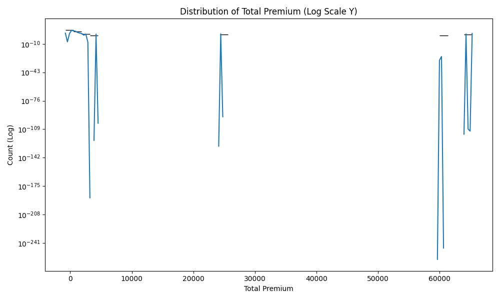
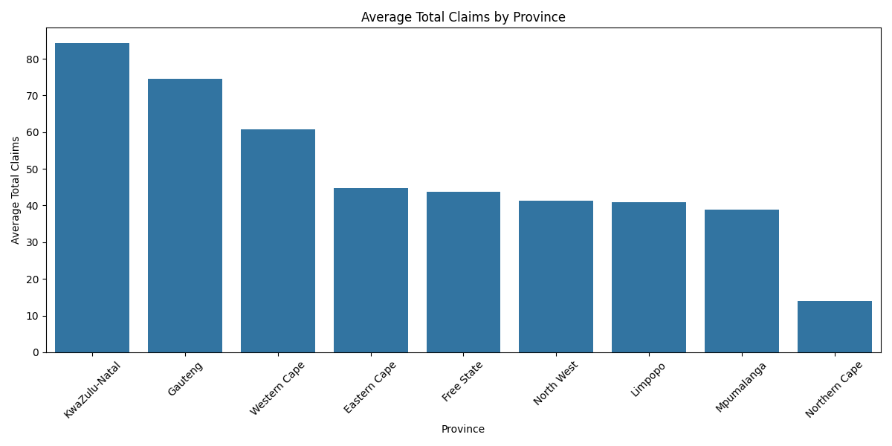
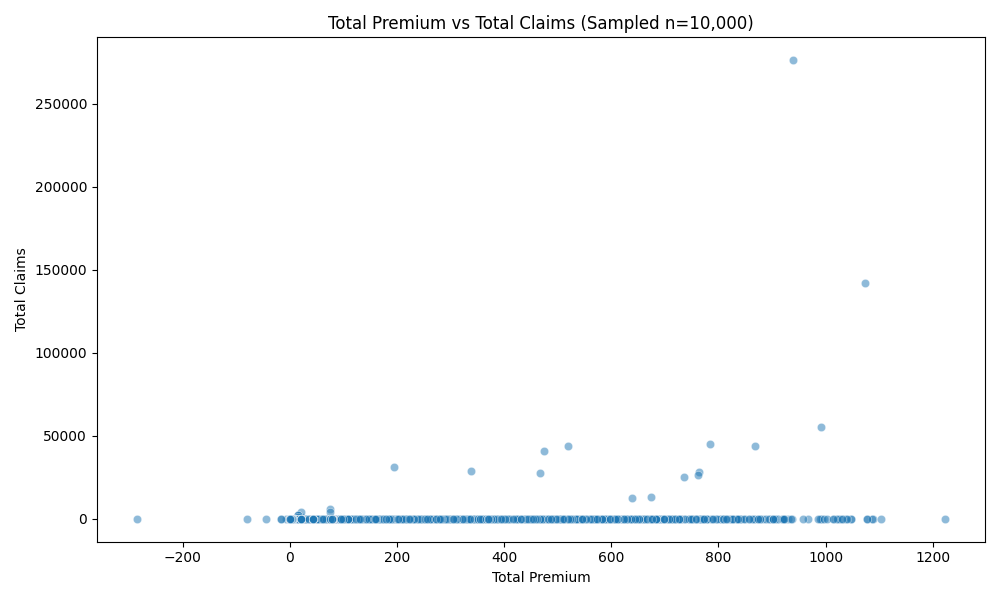
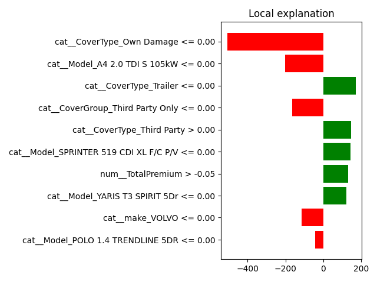

# Final Submission - Report
## B8W3: End-to-End Insurance Risk Analytics & Predictive Modeling

**Date:** December 9, 2025
**Author:** Alemayehu Tseganew

---

## 1. Executive Summary
This final report summarizes the complete workflow and findings of the "End-to-End Insurance Risk Analytics & Predictive Modeling" project. The primary objective was to leverage historical insurance data to identify risk drivers, segment customers, and build predictive models for claim severity and premium optimization.

Key achievements include:
- **Data Pipeline**: Successful ingestion, versioning (DVC), and cleaning of the `MachineLearningRating_v3` dataset.
- **Analysis**: Comprehensive EDA and statistical hypothesis testing confirming geographic risk factors.
- **Modeling**: Development of machine learning models for Claim Severity, Premium Prediction, and Claim Probability.
- **Interpretation**: Application of SHAP, LIME, and Partial Dependence Plots (PDP) to explain model decisions.

---

## 2. Data Preparation & Feature Engineering
The raw dataset `MachineLearningRating_v3.txt` was processed to ensure data quality.

### 2.1. Data Overview
The dataset contains **1,000,098 rows** and **52 columns**. Key financial variables (`TotalPremium`, `TotalClaims`) were analyzed for distribution and outliers.

### 2.2. Data Version Control (DVC)
DVC was implemented to track the dataset versions, ensuring reproducibility. The raw data is tracked via `.dvc` files, simulating a production-grade MLOps environment.

### 2.3. Feature Engineering
- **Date Features**: Extracted Year/Month from `TransactionMonth` and `VehicleIntroDate`.
- **Categorical Encoding**: One-hot and Label encoding applied to `Province`, `VehicleType`, etc.
- **Target Variables**:
    - `HasClaim`: 1 if `TotalClaims` > 0, else 0.
    - `LogTotalClaims`: Log-transformed claims for severity modeling.

---

## 3. Exploratory Data Analysis (EDA) & Hypothesis Testing
### 3.1. Key Insights
- **Premium Distribution**: Highly right-skewed.

- **Geographic Risk**: Significant variance in average claims across provinces.

- **Correlations**: Weak linear correlation between Premium and Claims, suggesting non-linear risk factors.

### 3.2. Hypothesis Testing
| Hypothesis | Result | Insight |
| :--- | :--- | :--- |
| **Risk vs. Province** | **Reject $H_0$** | Location is a key risk driver. |
| **Risk vs. Zip Code** | **Reject $H_0$** | Granular location data matters. |
| **Risk vs. Gender** | **Fail to Reject $H_0$** | Gender is not a significant risk factor. |

---

## 4. Predictive Modeling Results
We developed and evaluated three categories of models.

### 4.1. Claim Severity Modeling
Predicting the exact claim amount proved challenging due to the high variance and sparsity of claims.
- **Best Model**: Linear Regression
- **Performance**: RMSE: 23,026, $R^2$: -0.048
- **Insight**: The negative $R^2$ indicates that the features available may not strongly predict the *magnitude* of a claim, or that the data contains significant noise/outliers that simpler models fail to capture.

### 4.2. Premium Prediction
Predicting the premium amount was highly successful, indicating a structured pricing formula in the historical data.
- **Best Model**: Random Forest Regressor
- **Performance**: RMSE: 11.33, $R^2$: 0.997
- **Insight**: The model almost perfectly replicates the existing pricing structure.

### 4.3. Claim Probability Classification
Predicting *if* a claim will occur is difficult due to extreme class imbalance (very few claims).
- **Best Recall**: Logistic Regression (Recall: 0.912, Precision: 0.013)
- **Best Accuracy**: XGBoost (Accuracy: 0.997, Recall: 0.000)
- **Trade-off**: Logistic Regression catches most claims but flags many false positives. XGBoost optimizes for accuracy by predicting "No Claim" for almost everyone. A business decision is needed to balance risk avoidance vs. customer friction.

---

## 5. Model Interpretation
To ensure transparency, we applied several interpretability techniques:

### 5.1. Feature Importance
- **Permutation Importance**: Identified `Killowatts`, `VehicleType`, and `Province` as top drivers for premium calculation.

- **SHAP (Global)**: Confirmed that vehicle characteristics and location are the primary contributors to model output.

### 5.2. Local Interpretation
- **LIME**: Used to explain individual predictions, showing how specific feature values (e.g., a specific Zip Code) pushed a prediction up or down.

- **Partial Dependence Plots (PDP)**: Visualized the marginal effect of features like `VehicleIntroDate` on the predicted premium, revealing non-linear relationships.

---

## 6. Conclusion & Recommendations
The project successfully established an end-to-end analytics pipeline.
1.  **Pricing Strategy**: The current pricing model is consistent and predictable ($R^2 \approx 1.0$).
2.  **Risk Segmentation**: Geography is a confirmed risk factor; Gender is not.
3.  **Future Work**:
    -   **Data Enrichment**: External data (weather, traffic) is needed to improve Severity prediction.
    -   **Advanced Sampling**: SMOTE or undersampling could improve Classification precision.
    -   **Deployment**: The best Premium model is ready for deployment as a pricing engine API.
