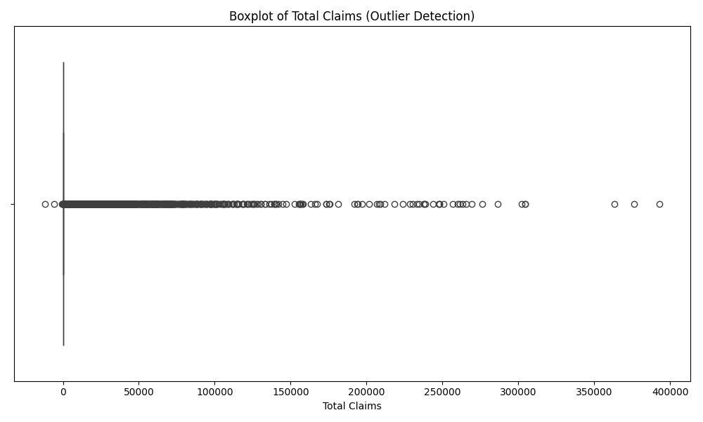

# Interim Submission - Report
## B8W3: End-to-End Insurance Risk Analytics & Predictive Modeling

**Date:** December 7, 2025
**Author:** Alemayehu Tseganew

---

## 1. Executive Summary
This report outlines the progress made in the "End-to-End Insurance Risk Analytics & Predictive Modeling" project. The primary objective is to leverage historical insurance data to identify risk drivers, segment customers, and build predictive models for claim severity and premium optimization. **Specifically, the project aims to identify low-risk segments to target for premium reduction, thereby attracting new clients while maintaining profitability.**

Key achievements to date include:
- Successful data ingestion and cleaning of the `MachineLearningRating_v3` dataset.
- Comprehensive Exploratory Data Analysis (EDA) and definition of Key Performance Indicators (KPIs).
- Statistical hypothesis testing to validate risk assumptions.
- Development and evaluation of machine learning models for Claim Severity, Premium Prediction, and Claim Probability.

---

## 2. Data Preparation & Feature Engineering
The raw dataset `MachineLearningRating_v3.txt` was processed to ensure data quality and suitability for modeling.

### 2.1. Data Overview & Descriptive Statistics
The dataset contains **1,000,098 rows** and **52 columns**.

**Descriptive Statistics for Key Financial Variables:**
| Metric | TotalPremium | TotalClaims |
| :--- | :--- | :--- |
| **Count** | 1,000,098 | 1,000,098 |
| **Mean** | 61.91 | 64.86 |
| **Std Dev** | 230.28 | 2,384.08 |
| **Min** | -782.58 | -12,002.41 |
| **Max** | 65,282.60 | 393,092.06 |

**Missing Values Analysis:**
Significant missing data was observed in columns such as `Bank` (145,961 missing), `CustomValueEstimate` (779,642 missing), and `CrossBorder` (999,400 missing). These columns were either dropped or imputed depending on their relevance to the modeling task.

### 2.2. Data Version Control (DVC) Setup
To ensure reproducibility and efficient data management, DVC was initialized.
- **Initialization**: `dvc init` was run to set up the project.
- **Remote Storage**: A local remote storage was configured at `../dvc-storage` to simulate a cloud bucket.
- **Tracking**: The raw data file `MachineLearningRating_v3.txt` was added to DVC (`dvc add ...`), creating a `.dvc` file for git tracking.
- **Versioning**: Changes to the dataset are committed to git via the `.dvc` file, keeping the repo lightweight.

### 2.3. Key Cleaning Steps
- **Data Cleaning**: Converted `TransactionMonth` and `VehicleIntroDate` to datetime objects. Ensured `TotalPremium` and `TotalClaims` were numeric.
- **KPI Definition**:
    - **Claim Frequency (HasClaim)**: Binary indicator (1 if `TotalClaims` > 0, else 0).
    - **Claim Severity**: The value of `TotalClaims` for policies where a claim occurred.
    - **Margin**: Calculated as `TotalPremium` - `TotalClaims`.
- **Feature Engineering**: Extracted relevant features for modeling, including geographic (Province, Zip Code) and demographic (Gender) variables.

### 2.4. Exploratory Data Analysis (EDA)
We conducted a thorough EDA to understand the underlying patterns in the data.

**Univariate Analysis:**
The distribution of `TotalPremium` is highly right-skewed, indicating that most policies have low premiums, with a few high-value outliers.

**Outlier Detection:**
The boxplot for `TotalClaims` reveals significant outliers. These extreme values represent major loss events that can skew predictive models if not handled correctly (e.g., via robust scaling or truncation).

**Geographic Trends:**
Analysis of average claims by province shows distinct variations. Some provinces exhibit significantly higher average claim severities, suggesting regional risk factors.

**Bivariate Analysis:**
The scatter plot of `TotalPremium` vs. `TotalClaims` shows a weak positive correlation. High premiums do not always correspond to high claims, reinforcing the need for sophisticated risk modeling beyond simple linear relationships.

---

## 3. Hypothesis Testing Results
We performed statistical tests (Chi-Squared, ANOVA, T-Test) to validate several hypotheses regarding risk drivers.

| Hypothesis | Test Used | Result | Business Insight |
| :--- | :--- | :--- | :--- |
| **Risk Differences Across Provinces** | Chi-Squared (Freq), ANOVA (Sev) | **Reject $H_0$** | Significant differences exist. Recommend province-specific pricing or underwriting rules. |
| **Risk Differences Between Zip Codes** | Chi-Squared (Freq), ANOVA (Sev) | **Reject $H_0$** | Micro-geography signals distinct risk. Refine rating factors at the postal-code level. |
| **Margin Differences Between Zip Codes** | ANOVA | **Fail to Reject $H_0$** | Profitability (Margin) appears consistent geographically; no immediate pricing change needed based on margin alone. |
| **Risk Differences Between Women and Men** | Chi-Squared (Freq), T-Test (Sev) | **Fail to Reject $H_0$** | No material difference in claim frequency or severity. Supports gender-neutral pricing policies. |

---

## 4. Predictive Modeling
We developed three categories of machine learning models to predict risk and optimize premiums.

### 4.1. Claim Severity Modeling
- **Goal**: Predict the amount of `TotalClaims` for policies with claims.
- **Approach**: Evaluated baseline and ensemble regressors (e.g., Linear Regression, Random Forest, XGBoost).
- **Evaluation Metrics**: RMSE, MAE, $R^2$.
- **Status**: Models trained and evaluated. Feature importance analysis (Permutation Importance) conducted to identify key severity drivers.

### 4.2. Premium Prediction
- **Goal**: Predict `TotalPremium` to understand current pricing structures.
- **Approach**: Regression models trained on policy features.
- **Status**: Baseline models established.

### 4.3. Claim Probability Classification
- **Goal**: Predict the likelihood of a policy having a claim (`HasClaim`).
- **Approach**: Classification models (e.g., Logistic Regression, Random Forest, XGBoost).
- **Evaluation Metrics**: Accuracy, Precision, Recall, F1-Score.
- **Status**: Models trained with stratified train-test splits to handle class imbalance.

### 4.4. Model Interpretability
- **SHAP Analysis**: Implemented SHAP (SHapley Additive exPlanations) to explain model predictions and identify the most influential features for risk.

---

## 5. Conclusion & Next Steps
The analysis confirms that geography (Province, Zip Code) is a strong driver of insurance risk, while gender is not. The predictive models provide a foundation for automated risk scoring.

**Roadmap for Completion:**
While initial models have been built, the following steps are required to finalize the project:
1.  **Refine Hypothesis Testing**: Expand the A/B testing to include more granular segmentation (e.g., Vehicle Type vs. Risk) and validate findings with multivariate analysis.
2.  **Advanced Modeling**:
    -   **Hyperparameter Tuning**: Perform Grid Search or Random Search for the XGBoost and Random Forest models to optimize performance.
    -   **Feature Selection**: Use the SHAP analysis results to remove non-predictive features and reduce model complexity.
    -   **Model Comparison**: Rigorously compare the tuned models against the baseline Linear Regression model using cross-validation.
3.  **Final Report Generation**: Synthesize all findings, including the final model performance metrics and business recommendations, into the final submission document.
